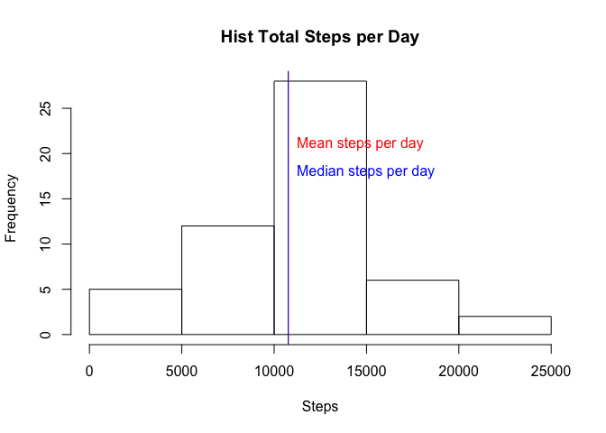
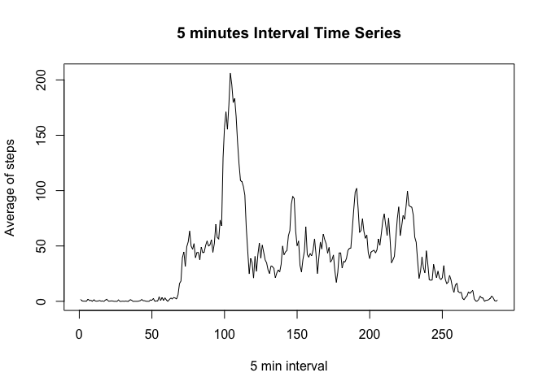
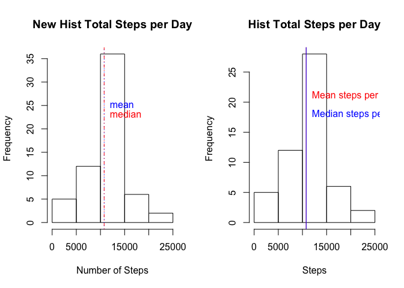
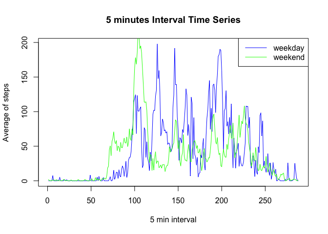

# Reproducible Research: Peer Assessment 1


Hello! My name is Guillem, and I'm going to explain how I achieved the Reproducible Research: Peer Assessment 1. 

So, I am going to respond how I've managed to do the following questions: 

* *Loading and preprocessing the data*
* *What is mean total number of steps taken per day?*
* *What is the average daily activity pattern?*
* *Imputing missing values*
* *Are there differences in activity patterns between weekdays and weekends?*

So, let's get started!

## Loading and preprocessing the data

The first thing a programmer should do is to load the needed libraries on the top of the file:


```r
library(knitr)
suppressWarnings(suppressMessages(library(dplyr)))
```

- Load the data (i.e. read.csv())

I extracted the information of the zipped file and read the csv that is inside of it and saving the output in memory.

Also, I am going to cleanup the garbage data that's inside the table and format each column to his type.

Also, I store the original data to do analysis of the missing values.


```r
unzip("activity.zip")
data <- read.csv("activity.csv")
```

- Process/transform the data (if necessary) into a format suitable for your analysis


```r
activity <- data[complete.cases(data),]
activity$date <- as.Date(activity$date, "%Y-%m-%d")
```


## What is mean total number of steps taken per day?


- Calculate the total number of steps taken per day


```r
total_steps <- sum(activity$steps)
steps_per_day <- activity %>% 
                  group_by(date) %>% 
                  summarize(sum=sum(steps))
knitr::kable(head(steps_per_day))
```


date            sum
-----------  ------
2012-10-02      126
2012-10-03    11352
2012-10-04    12116
2012-10-05    13294
2012-10-06    15420
2012-10-07    11015

- So, the histogram, with the mean and the median should look like this:


```r
steps_per_day <- steps_per_day$sum
mean_steps_per_day <- mean(steps_per_day)
median_steps_per_day <- median(steps_per_day)

hist(steps_per_day, main="Hist Total Steps per Day", 
                    xlab="Steps")
# Print the mean line
abline(v=mean_steps_per_day,col="red")
text(mean_steps_per_day,21,labels="Mean steps per day", 
                            pos=4, 
                            col="red")
# Print the median line
abline(v=median_steps_per_day,col="blue")
text(median_steps_per_day,18, labels="Median steps per day", 
                              pos=4, 
                              col="blue")
```

 

As we can see, the mean and the median are quite the same.

## What is the average daily activity pattern?

- Make a time series plot (i.e. type = "l") of the 5-minute interval (x-axis) and the average number of steps taken, averaged across all days (y-axis)


```r
#Make a time series plot (i.e. type = "l") of the 5-minute interval (x-axis) and the average number of steps taken, averaged across all days (y-axis)
interval <- activity %>% 
              group_by(interval) %>% 
              summarize(mean=mean(steps))
interval_steps_mean <- interval$mean
max_steps <- max(interval_steps_mean)
plot(interval_steps_mean, type="l",  
                          main="5 minutes Interval Time Series",
                          xlab="5 min interval",
                          ylab="Average of steps")
```

 

- Which 5-minute interval, on average across all the days in the dataset, contains the maximum number of steps?


```r
  which.max(interval_steps_mean)
```

```
## [1] 104
```

## Imputing missing values

- Calculate and report the total number of missing values in the dataset (i.e. the total number of rows with NAs)


```r
  MissingVal <- data %>% mutate(valueMissing = complete.cases(date,interval,steps))
  MissingVal$date <- as.Date(MissingVal$date, "%Y-%m-%d")
  nrow(subset(MissingVal, valueMissing == FALSE))
```

```
## [1] 2304
```

- Devise a strategy for filling in all of the missing values in the dataset. The strategy does not need to be sophisticated. For example, you could use the mean/median for that day, or the mean for that 5-minute interval, etc.

What I am going to do, is calculate the mean of the same interval per missing row value, apply the result and rounding it.


```r
  for (row in 1:nrow(MissingVal)){
     row_interval <- MissingVal[row,3]
     row_date <- MissingVal[row,2]
     if(MissingVal[row,]$valueMissing == FALSE){
         mean_date_interval <-  activity %>% 
                                   filter(interval==row_interval)
         MissingVal[row,1] <- round(mean(mean_date_interval$steps, na.rm=TRUE))
     }
 }
```

- Make a histogram of the total number of steps taken each day and Calculate and report the mean and median total number of steps taken per day. Do these values differ from the estimates from the first part of the assignment? What is the impact of imputing missing data on the estimates of the total daily number of steps?

According to the following histogram, it does not seem to differ from the original dataset.


```r
new_steps_by_date = MissingVal %>% 
                  group_by(date) %>%
                  summarize(sum = sum(steps))
new_sum_steps_by_date <- new_steps_by_date$sum
new_mean_steps_by_date <- mean(new_sum_steps_by_date)
new_median_steps_by_date <- median(new_sum_steps_by_date)

par(mfrow=c(1,2))

### plot the original histogram
hist(new_sum_steps_by_date, main="New Hist Total Steps per Day", xlab="Number of Steps")
abline(v=new_mean_steps_by_date, lty=3, col="blue")
abline(v=new_median_steps_by_date, lty=4, col="red")
text(new_mean_steps_by_date,25,labels="mean", pos=4, col="blue")
text(new_median_steps_by_date,23,labels="median", pos=4, col="red")

##### SECOND hist
total_steps <- sum(activity$steps)
steps_per_day <- activity %>% 
                  group_by(date) %>% 
                  summarize(sum=sum(steps))
steps_per_day <- steps_per_day$sum
mean_steps_per_day <- mean(steps_per_day)
median_steps_per_day <- median(steps_per_day)

hist(steps_per_day, main="Hist Total Steps per Day", 
                    xlab="Steps")
# Print the mean line
abline(v=mean_steps_per_day,col="red")
text(mean_steps_per_day,21,labels="Mean steps per day", 
                            pos=4, 
                            col="red")
# Print the median line
abline(v=median_steps_per_day,col="blue")
text(median_steps_per_day,18, labels="Median steps per day", 
                              pos=4, 
                              col="blue")
```

 


## Are there differences in activity patterns between weekdays and weekends?

- Create a new factor variable in the dataset with two levels – “weekday” and “weekend” indicating whether a given date is a weekday or weekend day.


```r
activity$date <- as.Date(strptime(activity$date, format="%Y-%m-%d"))
activity$day <- weekdays(activity$date)
wdays = activity %>% 
          mutate(date= as.Date(strptime(date, format="%Y-%m-%d"))) %>%
          mutate(day= weekdays(date)) %>%
          mutate(day= ifelse(day %in% c("sabado","domingo"),
                                "weekend", "weekday")) %>%
          group_by(interval,day) %>%
          summarize(mean=mean(steps))
```

- Make a panel plot containing a time series plot (i.e. type = "l") of the 5-minute interval (x-axis) and the average number of steps taken, averaged across all weekday days or weekend days (y-axis). See the README file in the GitHub repository to see an example of what this plot should look like using simulated data.


```r
weekend_days_mean <- wdays[wdays$day %in% c("weekend"),]$mean
weekday_days_mean <- wdays[wdays$day %in% c("weekday"),]$mean
plot(weekend_days_mean,   type="l",  
                          main="5 minutes Interval Time Series",
                          xlab="5 min interval",
                          ylab="Average of steps",
                          col="blue")
lines(weekday_days_mean,col="green")
legend("topright", lty=c(1,1), col = c("blue", "green"), legend = c("weekday", "weekend"), seg.len=3)
```

 
